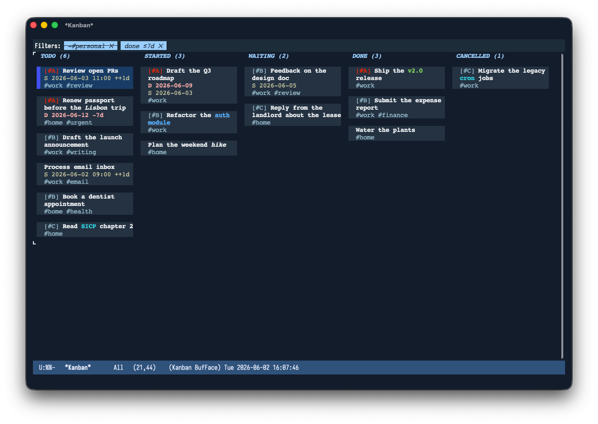
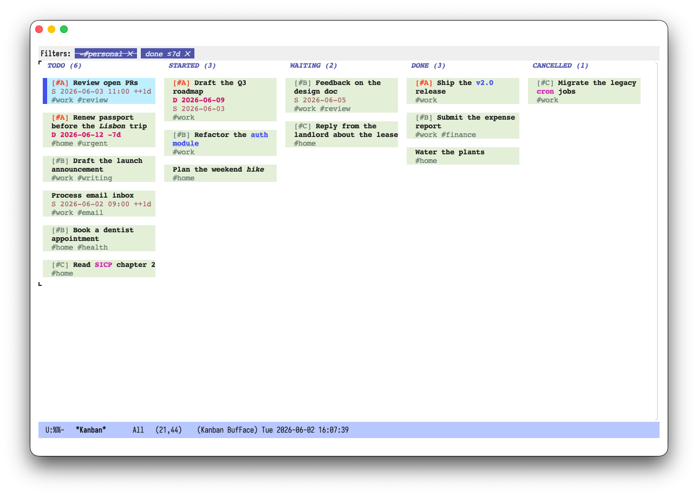

#+title: org-kanban-modern
#+author: Gregg Rothmeier
#+options: toc:nil num:nil

A modern, mouse- and keyboard-driven *kanban board* for Org-mode TODOs.

Columns are TODO states; cards are your TODO headings, pulled live from a
configurable set of Org files.  The board is inspired by the visual polish of
[[https://github.com/minad/org-modern][org-modern]] and the tag-filtering UX of
[[https://github.com/skeeto/elfeed][elfeed]].

* Features

- *Columns from your workflow.*  Defaults to the keywords in
  ~org-todo-keywords~; fully configurable.
- *Live data.*  Cards are collected from ~org-kanban-modern-files~ (defaults to
  ~org-agenda-files~).
- *Click to select.*  Click a card to select it; the selection is shown with a
  distinct highlight.
- *Keyboard to move.*  Move the selected card between columns; the change is
  *written back* to the source Org file via ~org-todo~ (logging/notes honored).
- *Edit cards in place.*  Set the selected card's TODO state, priority, or tags
  with the usual Org menus (=s= / =,= / =:=); edits are written back to the
  source heading and the board refreshes.
- *Tags on cards, elfeed-style filtering.*  Tags appear as clickable chips that
  highlight on hover.  Left-click a tag on a card to *include* it (cards must
  carry every included tag); shift-click (=S-mouse-1=) to *exclude* it (cards
  carrying it are hidden).  A tag is only ever in one of the two filters.  Active
  filters appear as chips in the header line — =+#tag= for includes and =-#tag=
  for excludes — click one to remove it.  Tag chips honor Org's
  ~org-tag-faces~, so per-tag colors show through on the board; disable with
  ~org-kanban-modern-use-tag-faces~.
- *Priority filtering.*  Filter by Org priority, with a clickable priority
  cookie on each card.
- *Priority coloring.*  The =[#X]= priority cookie on each card is colored
  using your configured ~org-priority-faces~ — the same source =org-agenda=
  uses (see ~org-kanban-modern-priority-style~).
- *Planning timestamps.*  A card shows its =SCHEDULED= and =DEADLINE=
  timestamps when set, each on its own line beneath the title, with any
  repeater (e.g. =+1w=) preserved.  The redundant day-of-week name is
  dropped by default so timestamps fit the card width; keep it with
  ~org-kanban-modern-planning-compact~.  Toggle the lines with
  ~org-kanban-modern-show-planning~ and set the glyphs with
  ~org-kanban-modern-scheduled-glyph~ / ~org-kanban-modern-deadline-glyph~.
- *Sorting.*  Within each column, cards are sorted by Org priority (highest
  first) by default.  Like ~org-agenda~, an unprioritized card is treated as
  ~org-default-priority~ (normally =[#B]=), so it interleaves with explicit
  =[#B]= cards.  Set ~org-kanban-modern-sort~ to ~document~ for source order,
  or to a predicate for a custom order.

* Screenshots

** Dark Mode Example (ef-maris-dark)

** Light Mode Example (ef-light)

* Installation

The package lives at [[https://github.com/greggroth/org-kanban-modern][github.com/greggroth/org-kanban-modern]].

** With ~use-package~ and ~:vc~ (Emacs 30+)

#+begin_src emacs-lisp
(use-package org-kanban-modern
  :vc (:url "https://github.com/greggroth/org-kanban-modern" :rev :newest)
  :commands (org-kanban-modern))
#+end_src

** With ~package-vc-install~ (Emacs 29+)

#+begin_src emacs-lisp
(package-vc-install "https://github.com/greggroth/org-kanban-modern")
#+end_src

** Manual clone (any supported Emacs, 28.1+)

#+begin_src sh
git clone https://github.com/greggroth/org-kanban-modern.git ~/code/org-kanban-modern
#+end_src

#+begin_src emacs-lisp
(add-to-list 'load-path "~/code/org-kanban-modern")
(require 'org-kanban-modern)
#+end_src

* Org configuration

This package is deliberately a *view* over Org: it reuses the standard
=org-mode= and =org-agenda= settings you already have rather than inventing its
own.  No special setup is required to get started, but the board honors the
settings below, so customizing them in Org is reflected here too.

| Org / org-agenda setting              | What it drives on the board                       | Required?                  |
|---------------------------------------+---------------------------------------------------+----------------------------|
| ~org-todo-keywords~                     | Default columns                                   | No (used via ~columns~)      |
| ~org-agenda-files~                      | Default files scanned for cards                   | No (used via ~files~)        |
| ~org-log-done~                          | Writes the =CLOSED= timestamp the done filter reads | For the recently-done view |
| ~org-priority-faces~ / ~org-priority~     | Priority cookie colors                            | No                         |
| ~org-default-priority~                  | Where unprioritized cards sort (normally =[#B]=)    | No                         |
| ~org-tag-faces~                         | Tag chip colors                                   | No                         |
| ~org-scheduled~ / ~org-upcoming-deadline~ | =SCHEDULED= / =DEADLINE= line colors                  | No                         |

Moving a card runs ~org-todo~ on the source heading, so its TODO-state logging
and note prompts (e.g. ~org-log-into-drawer~, per-keyword logging) are honored
just as in a normal Org buffer.

** Recording when a TODO is marked done

The done-date filter (~org-kanban-modern-done-within-days~) keeps
recently-completed cards on the board and hides older ones.  It reads each done
heading's =CLOSED= timestamp, which Org only writes when you ask it to:

#+begin_src emacs-lisp
(setq org-log-done 'time)   ; or 'note to also prompt for a closing note
#+end_src

Without this, done headings have no =CLOSED= timestamp; such cards are always
shown (their age is unknown), so the day-window filter effectively can't hide
them.  Headings closed before you enabled logging are likewise always shown.

** Priorities, tags, and faces (inherited from Org)

The board pulls its colors straight from Org, so whatever you already customize
shows up here:

- *Priority colors* reuse ~org-priority-faces~ (falling back to the
  ~org-priority~ face), the same source =org-agenda= uses.
  ~org-default-priority~ (normally =[#B]=) controls where unprioritized cards
  land in the default priority sort.
- *Tag colors* reuse ~org-tag-faces~ on every tag chip; turn this off with
  ~org-kanban-modern-use-tag-faces~.
- *Planning colors* reuse Org's planning faces: ~org-kanban-modern-scheduled~
  inherits ~org-scheduled~ and ~org-kanban-modern-deadline~ inherits
  ~org-upcoming-deadline~, so timestamps track your theme like the rest of the
  board.

* Usage

Run =M-x org-kanban-modern= to open the board.

A ready-made sample board lives at [[file:examples/demo.org][examples/demo.org]] — open it and follow
the comment header (it sets ~org-kanban-modern-files~ and
~org-kanban-modern-columns~ to that file) to see every feature at once: all
five columns, priorities, tag chips, =SCHEDULED= / =DEADLINE= lines with
repeaters, inline markup, and recently-closed cards.

** Keybindings

| Key                  | Action                                      |
|----------------------+---------------------------------------------|
| =mouse-1= (card)       | Select card                                 |
| =mouse-1= (card tag)   | Toggle that tag in the *include* filter       |
| =S-mouse-1= (card tag) | Toggle that tag in the *exclude* filter       |
| =mouse-1= (header tag) | Remove that tag from the filter             |
| =n= / =p=                | Select next / previous card in column       |
| =f= / =b=                | Move selection to next / previous column    |
| =TAB= / =S-TAB=          | Move selection forward / backward column    |
| =M-<right>= / =>=        | Move card to next column                    |
| =M-<left>=  / =<=        | Move card to previous column                |
| =s=                    | Set the selected card's TODO state          |
| =,=                    | Set the selected card's priority            |
| =:=                    | Set the selected card's tags                |
| c                    | Run =org-capture=                           |
| =RET= / =o=              | Visit card's heading in its Org file        |
| =double-mouse-1=       | Visit card's heading in its Org file        |
| =t t= / =t +=            | Toggle a tag in the *include* filter (prompt) |
| =t -=                  | Toggle a tag in the *exclude* filter (prompt) |
| =t r=                  | Remove a tag from the filter (prompt)       |
| =t p=                  | Filter by priority (prompt)                 |
| =t c=                  | Clear all filters                           |
| =t d=                  | Set the done-card date window (prompt)      |
| =g=                    | Refresh                                     |
| =q=                    | Quit                                        |

With a prefix argument (=C-u RET= / =C-u o=), the card's heading opens in
another window instead of the current one.

Board edits use Org's normal commands and leave the source Org buffer unsaved,
matching Org Agenda.  Save the Org buffer explicitly when ready.

* Customization

See =M-x customize-group RET org-kanban-modern RET=.  Key variables:

- ~org-kanban-modern-files~ — files to scan (default ~org-agenda-files~).
- ~org-kanban-modern-columns~ — column keywords (default from
  ~org-todo-keywords~).
- ~org-kanban-modern-sort~ — order of cards within each column.  ~priority~
  (default) sorts highest Org priority first; like ~org-agenda~, an
  unprioritized card is treated as ~org-default-priority~ (normally =[#B]=) and
  interleaves with explicit =[#B]= cards.  Equal priorities keep document
  order.  ~document~ keeps source order.  May also be a predicate of two cards
  (passed to ~sort~).
- ~org-kanban-modern-column-width~ — fixed column width in characters.
- ~org-kanban-modern-column-gap~ — blank columns between board columns
  (default 2).
- ~org-kanban-modern-buffer-name~ — name of the board buffer (default
  ~*Kanban*~).
- ~org-kanban-modern-render-markup~ — render Org inline markup in card
  titles (default ~t~).  Emphasis (=*bold*=, =/italic/=, =~code~=, …) is
  shown with its face and markers hidden, and links =[[target][desc]]= are
  shown as their description.  Set to ~nil~ to display raw Org text.
- ~org-kanban-modern-done-within-days~ — only show done cards closed within
  this many days (default 7; ~nil~ shows all).  Done cards with no =CLOSED=
  timestamp are always shown, and active (non-done) cards are always shown
  regardless of this setting.  See [[*Org configuration][Org configuration]] for how to record the
  =CLOSED= timestamp.  Adjust live with =t d=, or click the =done ≤Nd ✕=
  header chip to show all done cards.
- ~org-kanban-modern-priority-style~ — how a card reflects its Org priority
  (default ~cookie~).  Colors come from Org's own ~org-priority-faces~ (with
  the ~org-priority~ face as fallback), the same source =org-agenda= uses, so
  priorities look consistent across Org.  Choices: ~cookie~ (color the =[#X]=
  cookie — the default) or ~nil~ (no priority coloring).
- ~org-kanban-modern-show-planning~ — show each card's =SCHEDULED= and
  =DEADLINE= timestamps when set (default ~t~).  Each is rendered on its own
  line beneath the title with any repeater preserved.  Set to ~nil~ to hide
  them.
- ~org-kanban-modern-use-tag-faces~ — color tag chips using Org's
  ~org-tag-faces~ (default ~t~).  Each tag's color is layered onto the chip
  while the package's state decoration is preserved (included tags stay
  inverse, excluded tags keep their strike-through), and a fixed-pitch family
  is forced so a per-tag face cannot break the card grid.  Set to ~nil~ to use
  the package faces only.
- ~org-kanban-modern-scheduled-glyph~ / ~org-kanban-modern-deadline-glyph~ —
  prefixes shown before the scheduled (default ="S "=) and deadline (default
  ="D "=) timestamps.  These default to ASCII labels so their width is
  deterministic: cards are a fixed-pitch monospace grid, and a non-ASCII glyph
  that is absent from your fixed-pitch font is drawn from a fallback font whose
  advance does not align to the grid (misaligning the timestamp).  You may set
  a Unicode glyph (e.g. ="◷ "= / ="⚑ "=) only if it is present in your
  fixed-pitch font with matching metrics.
- ~org-kanban-modern-planning-compact~ — when non-nil (the default), omit the
  day-of-week name from planning timestamps (e.g. =2026-06-03 11:00 +1w=
  instead of =2026-06-03 Wed 11:00 +1w=) so they fit the card width.  Set to
  ~nil~ to keep the weekday name.
- ~org-kanban-modern-line-spacing~ — buffer-local ~line-spacing~ for the board
  (default ~0~).  Cards are solid colored tiles; if your frame or theme adds
  inter-line spacing, the card background does not fill it and faint stripes
  appear between a card's wrapped lines.  ~0~ removes that space so tiles read
  as continuous.  (Note: ~nil~ inherits the frame's spacing — the usual cause
  of the stripes — so prefer ~0~.)

* License

GPL-3.0-or-later.  See [[file:LICENSE][LICENSE]].
